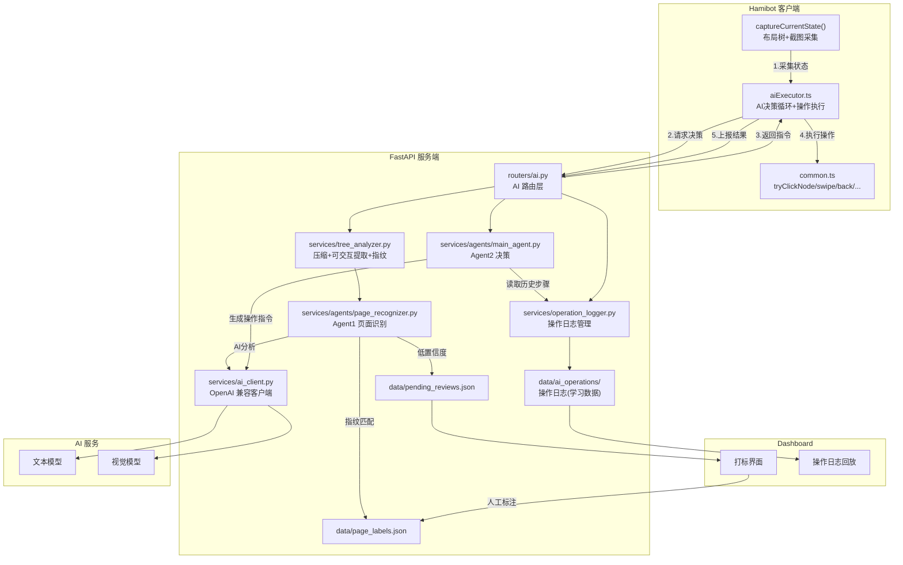
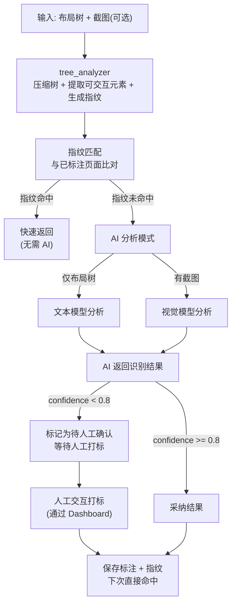
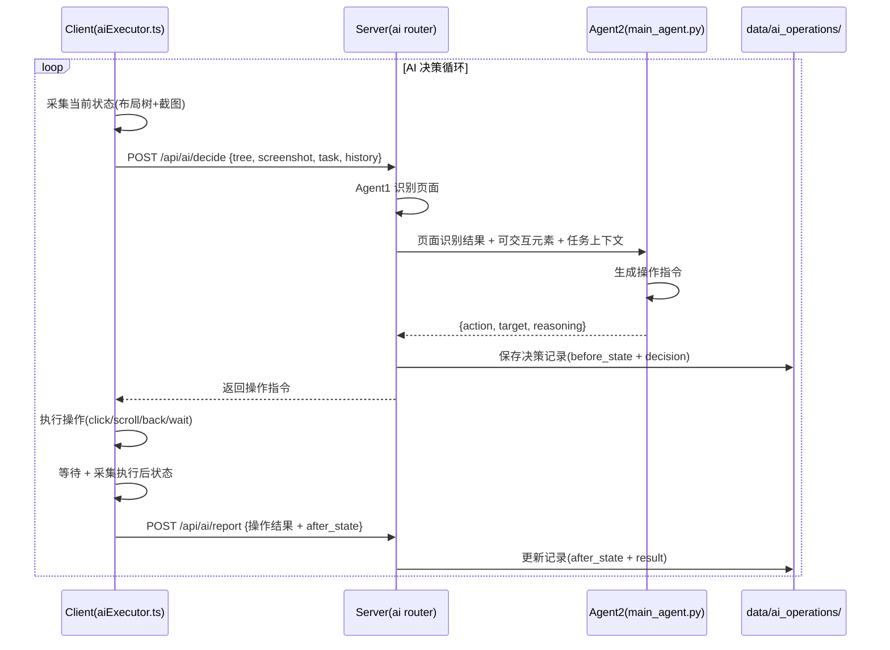
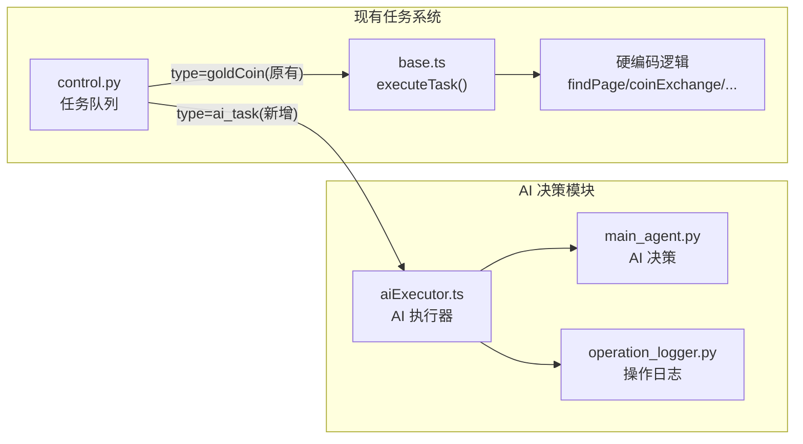
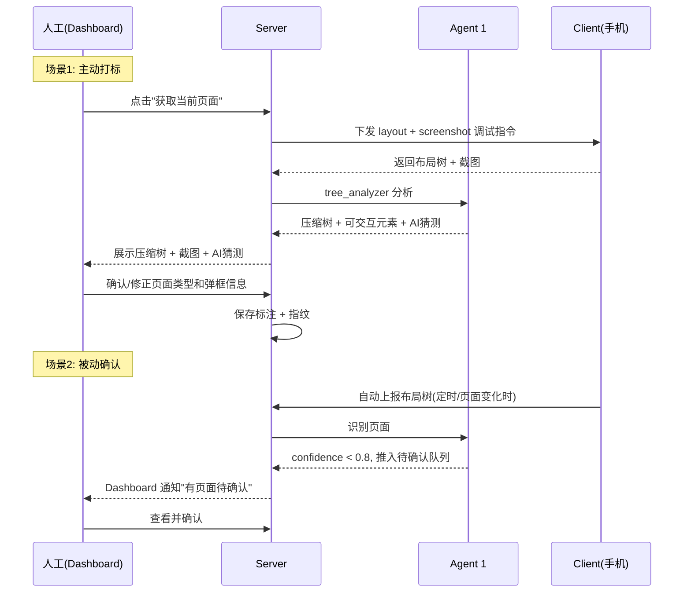

<!-- 与 Cursor 计划文档同步，便于仓库内查阅与版本管理 -->

# AI Agent 模块规划

## 现状分析

当前项目是 **Hamibot 安卓自动化脚本 (TS) + 局域网 FastAPI 本地服务 (Python)** 的架构。已具备：

- 成熟的无障碍布局树抓取（`dumpActiveWindowLayout`，每个节点含 cls/text/desc/id/bounds/a11y属性）
- 截图能力（`captureScreen()` 返回 base64 JPG）
- 完整的调试系统（debug 指令队列 + Dashboard）
- `.env` 中已预留 AI 配置（`AI_BASE_URL` / `AI_API_KEY` / `AI_MODEL` / `AI_VISION_MODEL`）

**尚未实现**：AI 调用代码、Agent 逻辑、页面识别、弹框检测、手动打标。

## 整体架构



## 实现任务清单（参考）

- 基础设施：扩展 `config.py` AI 字段 + `ai_client.py` + `requirements.txt`
- 树分析器：`tree_analyzer.py`（压缩、可交互元素、指纹）
- Agent 1：`page_recognizer.py`（指纹 / AI / 人工待确认）
- AI 路由：`routers/ai.py`（recognize / decide / label / operation）
- 打标：`page_labels.json`、`pending_reviews.json`、Dashboard UI
- 操作日志：`operation_logger.py`、`data/ai_operations/`
- Agent 2：`main_agent.py`（操作指令）
- 客户端：`aiExecutor.ts` + `service.ts` + `base.ts` 中 `ai_task` 分支
- 视觉：`screenshot_base64` + `AI_VISION_MODEL`

---

## 一、基础设施层

### 1.1 扩展配置 ([server/core/config.py](server/core/config.py))

在 `Settings` 类中新增 AI 相关字段，使 `.env` 中的变量正式接入 Python 代码：

```python
class Settings(BaseSettings):
    PORT: int = 3000
    AI_BASE_URL: str = "https://api.openai.com/v1"
    AI_API_KEY: str = ""
    AI_MODEL: str = "gpt-4o-mini"
    AI_VISION_MODEL: str = ""       # 空则回退到 AI_MODEL
    AI_RESPONSE_FORMAT: bool = False
    OCR_WEAK_THRESHOLD: int = 3
    DEFAULT_TASK: str = "浏览当前页面，观察内容并汇报当前状态"
```

### 1.2 AI 客户端 (新建 `server/services/ai_client.py`)

封装 OpenAI 兼容的 HTTP 调用，统一管理 text/vision 两种模型：

- `chat(messages, model=None, json_mode=False)` -- 文本对话
- `chat_with_image(messages, image_base64, model=None)` -- 带图片的视觉对话
- 自动选择模型（vision 请求优先用 `AI_VISION_MODEL`）
- 统一错误处理与日志
- 依赖：`openai` Python SDK（需加入 `requirements.txt`）

### 1.3 布局树分析器 (新建 `server/services/tree_analyzer.py`)

原始布局树 JSON 可达 8000+ 行，远超 AI prompt 上限。该模块负责**压缩**和**结构化提取**两项工作：

#### 压缩策略

- **剪枝**：移除无 text/desc/id 且无有意义子节点的纯容器节点
- **深度限制**：默认压缩到 8 层，保留关键结构信息
- **摘要模式**：输出紧凑的缩进文本格式（而非 JSON），大幅减少 token 数
- **弹框候选提取**：识别 bounds 接近全屏但 z-order 较高的子树，标记为潜在弹框

压缩输出示例：

```
[FrameLayout] 0,0,1080,2400
  [RelativeLayout#web_root] 0,0,1080,2358
    [WebView text="首页"] 0,0,1084,2360
      [View#contentWrap] 0,0,1084,2360
        [View#tabBar] 0,2170,1084,2360
          [View text="首页"] (selected)
          [View text="消息"]
          [View text="发布"]
          [View text="我的"]
      [View#dialogMask] 0,0,1084,2360  ← 潜在弹框
        [View text="领取奖励"]
```

#### 可交互元素提取

从 a11y 属性中提取所有可交互元素，生成独立的 **actionable elements 列表**：

- 遍历树，筛选 `clickable=true` / `scrollable=true` / `longClickable=true` / `checkable=true` / `editable=true` 的节点
- 为每个可交互元素生成唯一的 **element_ref**（基于路径索引，如 `0.1.2.0.3`），后续可用于指定点击目标
- 记录元素的 text / desc / id / bounds / 交互类型
- 关联上下文：提取该元素的**父级容器文本**和**相邻兄弟节点文本**，为推理点击效果提供线索

输出示例：

```
可交互元素列表 (共 12 个):
[C01] 点击 | text="首页" | bounds=0,2170,271,2360 | 父级=#tabBar | → 可能：切换到首页Tab
[C02] 点击 | text="消息" | bounds=271,2170,542,2360 | 父级=#tabBar | → 可能：切换到消息Tab
[C03] 点击 | text="领取" | bounds=340,800,740,860 | 父级=#dialogMask | → 可能：关闭弹框并领取奖励
[C04] 滚动 | id="contentWrap" | bounds=0,0,1084,2170 | → 可能：滚动浏览更多内容
[C05] 点击 | desc="关闭" | bounds=980,200,1040,260 | 父级=#dialogMask | → 可能：关闭弹框
```

#### 页面结构指纹

对每次收集的树状数据生成**结构指纹**（不含动态文本内容），用于跨时间的页面结构对比：

- 提取固定的 DOM 骨架：cls 类型层级 + id 模式 + 关键容器的 bounds 比例
- 生成指纹哈希，相同结构的页面产出相同指纹
- 用于快速判断"当前页面是否和之前标注过的页面结构一致"

## 二、Agent 1：页面识别 Agent

### 2.1 模块位置：`server/services/agents/page_recognizer.py`

### 2.2 三种工作模式

Agent 1 有三种识别模式，按优先级递进：



**模式 A -- 指纹快速匹配（无 AI 调用）**

- 用 tree_analyzer 生成结构指纹，与 `page_labels.json` 中已标注页面的指纹对比
- 指纹匹配成功则直接返回历史标注结果，零延迟、零成本
- 适合：已经标注过的常见页面

**模式 B -- AI 自主分析**

- 指纹不匹配时，将压缩树 + 可交互元素列表 + (可选)截图发给 AI
- AI 需要同时完成：页面主题识别、弹框检测、可交互元素的点击效果推理
- 如果 AI 置信度 >= 0.8，自动采纳并保存为新标注（下次变为模式 A 快速命中）

**模式 C -- 人工辅助打标（AI 无法确定时）**

- AI 置信度 < 0.8 或返回 "unknown"，自动将该页面数据推入**待确认队列**
- Dashboard 上弹出提示，展示压缩树 + 截图 + AI 的初步猜测
- 人工选择/修正页面类型、标记弹框区域后确认
- 确认结果保存为标注数据，AI 下次不再困惑

### 2.3 输入

```python
class PageRecognizeRequest(BaseModel):
    package: str                          # com.taobao.idlefish
    activity: str                         # 当前 Activity
    tree: dict                            # 原始布局树
    screenshot_base64: Optional[str]      # 可选，截图
    save_snapshot: bool = True            # 是否保存本次数据用于后续分析
```

### 2.4 核心处理逻辑

1. **结构分析**（tree_analyzer，纯本地计算，不调 AI）
   - 压缩布局树 -> 紧凑文本
   - 提取所有可交互元素 -> actionable elements 列表
   - 生成结构指纹 -> fingerprint hash
   - 识别弹框候选区域（bounds 覆盖比 > 70% 且在主内容层之上的子树）
2. **指纹匹配**（对比 page_labels.json）
   - 精确匹配：指纹哈希完全一致
   - 模糊匹配：activity 相同 + 关键元素 ID/文本 重合度 > 80%
3. **AI 分析**（仅在指纹未命中时触发）
   - 将压缩树、可交互元素列表、activity 信息打包为 prompt
   - AI 需要返回：页面类型、弹框信息、**每个可交互元素的推理点击效果**
   - 如有截图，使用 vision 模型，截图 + 树状数据双重验证
4. **可交互元素点击效果推理**
   - tree_analyzer 先做**规则推理**（基于元素位置和上下文的启发式判断）：
     - 在 tabBar 区域内 -> "切换Tab到{text}"
     - text 含"关闭"/"X"/"取消" + 在弹框区域内 -> "关闭弹框"
     - text 含"确认"/"领取"/"立即" + 在弹框区域内 -> "确认弹框操作"
     - 在列表项内 -> "打开{text}详情"
     - editable=true -> "输入框，可填写内容"
     - scrollable=true -> "可滚动区域"
   - AI 再做**语义推理**（结合页面主题和元素上下文推断未知按钮的效果）

### 2.5 输出

```python
class ClickableElement(BaseModel):
    ref: str               # 元素路径引用，如 "0.1.2.0.3"
    action_type: str       # "click" | "scroll" | "long_click" | "edit" | "check"
    text: str              # 元素文本
    desc: str              # 无障碍描述
    element_id: str        # Android/Web ID
    bounds: list[int]      # [left, top, right, bottom]
    predicted_effect: str  # 推理的点击效果
    context: str           # 父级/相邻元素上下文

class PopupInfo(BaseModel):
    popup_type: str        # "ad" | "reward" | "confirm" | "guide" | "unknown"
    description: str       # "广告弹窗" / "领取金币奖励"
    bounds: list[int]
    close_hint: Optional[ClickableElement]  # 推荐的关闭方式

class PageRecognizeResult(BaseModel):
    page_type: str         # "home" | "my_page" | "product_detail" | "gold_coin" | "unknown"
    page_name: str         # 人类可读名称
    confidence: float      # 0~1
    has_popup: bool
    popups: list[PopupInfo]
    clickable_elements: list[ClickableElement]  # 所有可交互元素及推理效果
    fingerprint: str       # 页面结构指纹
    source: str            # "fingerprint" | "ai" | "pending_human" -- 识别来源
    need_human_confirm: bool  # 是否需要人工确认
```

### 2.6 历史数据学习

每次识别请求（无论哪种模式）都会保存一份**页面快照**到 `server/data/page_snapshots/`：

```
server/data/page_snapshots/
  {fingerprint}_{timestamp}.json    # 压缩树 + 可交互元素 + 识别结果
```

这些快照数据的用途：

- **同结构多次采样**：同一指纹的多次快照可以对比动态内容差异（如列表数据变化），帮助区分"结构相同但内容不同"的场景
- **Few-shot 样本源**：AI 分析时自动从历史快照中挑选已确认的同类页面作为 few-shot 示例
- **结构漂移检测**：当页面结构因 App 更新发生变化时（指纹变了但 activity 没变），自动标记为需要重新标注

### 2.7 Prompt 设计要点

- system prompt 定义闲鱼 App 的页面类型枚举及典型特征
- 附带 2-3 个 few-shot 示例（从标注数据中动态选取，优先选 activity 相同的）
- 弹框判定规则：overlay 层级 + bounds 覆盖主内容区 + 含关闭按钮特征
- 可交互元素效果推理：要求 AI 对每个可交互元素输出 `predicted_effect`，结合页面主题和元素语义
- 输出格式强制 JSON（或根据 `AI_RESPONSE_FORMAT` 配置决定）

## 三、Agent 2：决策模块（含客户端执行 + 操作日志）

这是整个 AI 系统的"行动力"，分为三个独立部分：服务端决策、客户端执行、操作日志。

### 3.1 整体流程



### 3.2 服务端决策 -- `server/services/agents/main_agent.py`

独立文件，只做一件事：**根据当前状态决定下一步操作**。

**输入**

```python
class DecideRequest(BaseModel):
    task: str                            # 当前任务描述，如 "领取金币"
    page_recognition: PageRecognizeResult # Agent 1 的结果
    clickable_elements: list[ClickableElement]  # 当前页面可交互元素
    compressed_tree: str                 # 压缩后的布局树
    screenshot_base64: Optional[str]     # 可选
    history: list[OperationRecord]       # 最近 N 步操作历史（从操作日志读取）
    step_count: int                      # 当前任务已执行步数
```

**输出 -- 操作指令**

```python
class ActionInstruction(BaseModel):
    action: str            # 操作类型（见下方枚举）
    target_ref: Optional[str]     # 目标元素 ref（如 "C03"），点击/滚动时必填
    target_bounds: Optional[list[int]]  # [left, top, right, bottom] 备用坐标定位
    target_text: Optional[str]    # 目标元素文本描述（辅助客户端定位）
    params: Optional[dict]        # 额外参数（如滚动方向、输入文本等）
    reasoning: str                # AI 决策理由
    expected_result: str          # 预期执行后会看到什么
    fallback: Optional[str]       # 如果主操作失败的备选方案描述
```

**支持的操作类型枚举**

- `click` -- 点击指定元素（通过 ref / bounds / text 定位）
- `long_click` -- 长按
- `scroll_down` / `scroll_up` -- 在指定区域内滚动
- `swipe` -- 自定义方向滑动（params 含 startX/Y, endX/Y, duration）
- `back` -- 系统返回键
- `wait` -- 等待指定毫秒（params.duration_ms）
- `close_popup` -- 关闭弹框（自动选择弹框的 close_hint）
- `input_text` -- 向 editable 元素输入文本（params.text）
- `done` -- 任务完成，退出决策循环
- `abort` -- 任务异常，终止并上报

**Prompt 设计要点**

- system prompt 明确操作类型枚举及其语义
- 注入最近 N 步操作历史，让 AI 理解上下文（避免重复操作、死循环）
- 注入可交互元素列表，AI 从中选择操作目标（而非凭空编造坐标）
- 设置防呆规则：连续 3 步相同操作 -> 强制换策略；总步数 > 30 -> 建议 abort
- 输出格式强制 JSON

### 3.3 客户端执行器 -- `src/toolKit/xianyu/service/aiExecutor.ts`

**独立文件**，封装 AI 指令的执行能力。其他地方（如 `base.ts` 的 `startTaskPoller`）只需调用此模块即可。

```
aiExecutor.ts 导出的函数:
├── startAiLoop(task)            -- 启动 AI 决策循环（主入口）
├── executeAction(instruction)   -- 执行单条操作指令
├── captureCurrentState()        -- 采集当前状态（布局树 + 截图 + package/activity）
├── reportActionResult(...)      -- 上报操作执行结果
└── stopAiLoop()                 -- 停止决策循环
```

**`executeAction` 内部映射**（复用现有 `common.ts` 中的工具函数）：

```
action           ->  实际操作
─────────────────────────────────────
click            ->  先 findByA11yId/findByRef 定位节点 -> tryClickNode
                     定位失败 -> 用 target_bounds 中心坐标 click(cx, cy)
long_click       ->  longClick(cx, cy)
scroll_down      ->  swipe(cx, startY, cx, endY, 500) 在 target_bounds 区域内
scroll_up        ->  swipe(cx, endY, cx, startY, 500)
swipe            ->  swipe(params.startX, params.startY, params.endX, params.endY, params.duration)
back             ->  back()
wait             ->  sleep(params.duration_ms || 1000)
close_popup      ->  从 popups[].close_hint 取 bounds -> click
input_text       ->  找到 editable 元素 -> setText(params.text)
done / abort     ->  退出循环，上报状态
```

**AI 决策循环（`startAiLoop`）**

```
while (not done and step < maxSteps):
    1. captureCurrentState()        // 布局树 + 截图
    2. POST /api/ai/decide          // 发送到服务端，获取操作指令
    3. executeAction(instruction)   // 在手机上执行
    4. sleep(instruction.wait_after || 1500)  // 等待页面响应
    5. captureCurrentState()        // 采集执行后状态
    6. POST /api/ai/report          // 上报结果（before + after + action + success）
    7. step++
```

**`findByRef` -- 新增的元素定位函数**

根据 AI 返回的 `target_ref`（如 "C03"）和 `target_text`，结合当前无障碍树定位真实节点：

- 优先用 text/desc 匹配（最稳定）
- 其次用 element id 匹配
- 最后用 bounds 坐标兜底（直接点击中心点）

### 3.4 操作日志系统 -- `server/data/ai_operations/`

**独立的数据存储**，记录每一次 AI 决策和客户端执行的完整过程，为后续 AI 学习提供数据支持。

#### 存储结构

```
server/data/ai_operations/
  {task_id}/                         # 每个任务一个目录
    meta.json                        # 任务元信息
    step_001.json                    # 第 1 步操作记录
    step_002.json                    # 第 2 步操作记录
    ...
```

#### 任务元信息 (`meta.json`)

```json
{
  "task_id": "ai_task_20260331_102300",
  "task_description": "领取金币",
  "started_at": "2026-03-31 10:23:00",
  "completed_at": "2026-03-31 10:25:30",
  "total_steps": 8,
  "result": "success",
  "device_info": { "screen": [1080, 2400], "package": "com.taobao.idlefish" }
}
```

#### 单步操作记录 (`step_NNN.json`)

```json
{
  "step": 1,
  "timestamp": "2026-03-31 10:23:05",
  "before_state": {
    "page_type": "home",
    "activity": "...MainActivity",
    "has_popup": true,
    "compressed_tree_ref": "step_001_before.txt",
    "screenshot_ref": "step_001_before.jpg",
    "clickable_elements": [...]
  },
  "decision": {
    "action": "close_popup",
    "target_ref": "C05",
    "target_text": "关闭",
    "reasoning": "首页有广告弹框，需要先关闭才能进行后续操作",
    "expected_result": "弹框消失，显示首页正常内容"
  },
  "execution": {
    "actual_action": "click",
    "actual_bounds": [980, 200, 1040, 260],
    "success": true,
    "duration_ms": 350
  },
  "after_state": {
    "page_type": "home",
    "has_popup": false,
    "compressed_tree_ref": "step_001_after.txt",
    "screenshot_ref": "step_001_after.jpg"
  },
  "evaluation": {
    "expected_met": true,
    "page_changed": false,
    "popup_resolved": true
  }
}
```

#### 操作日志的 API

- `POST /api/ai/operation/start` -- 客户端启动 AI 任务时调用，创建任务目录和 meta.json
- `POST /api/ai/operation/step` -- 每步操作完成后上报，保存 step_NNN.json
- `POST /api/ai/operation/complete` -- 任务结束时调用，更新 meta.json
- `GET /api/ai/operations` -- 查询历史任务列表（Dashboard 查看）
- `GET /api/ai/operation/{task_id}` -- 查询单个任务详情（含所有步骤）
- `GET /api/ai/operation/{task_id}/replay` -- 回放某个任务的操作流程（Dashboard 可视化）

#### 操作日志管理 -- `server/services/operation_logger.py`

独立文件，只负责操作日志的读写和管理：

- `create_task(task_description)` -> task_id
- `save_step(task_id, step_data)` -> step_file_path
- `complete_task(task_id, result)` -> None
- `get_task_history(task_id)` -> list[step_data]
- `get_recent_steps(task_id, n)` -> 最近 N 步（喂给 Agent 2 做上下文）
- `cleanup_old_tasks(days)` -> 清理过期数据

#### 数据价值

这些操作日志积累后，可以用于：

- **操作模式学习**：统计"在某类页面 + 某类弹框下，最终成功的操作序列是什么"
- **失败分析**：哪些决策导致了 abort/死循环，优化 prompt 或规则
- **Few-shot 素材**：将成功的操作序列作为 AI 的 few-shot 示例
- **自动化回归测试**：用历史操作序列 replay，验证 AI 决策的稳定性

### 3.5 与现有任务系统的关系



- **不替换**现有 `control.py` 的任务队列和硬编码逻辑
- 新增任务类型 `ai_task`，当任务队列下发此类型时，由 `aiExecutor` 接管
- 硬编码逻辑（如 `goldCoin` -> `findPage` -> `coinExchange`）继续保留，AI 作为**补充通道**
- 未来可以逐步将硬编码逻辑迁移到 AI 决策，但不强制

## 四、手动打标系统（人机协作）

### 4.1 交互流程



### 4.2 数据结构 (`server/data/page_labels.json`)

```json
[
  {
    "id": "label_001",
    "page_type": "home",
    "page_name": "闲鱼首页",
    "activity": "com.taobao.idlefish.maincontainer.activity.MainActivity",
    "fingerprint": "a3f8b2c1...",
    "features": {
      "key_texts": ["首页", "消息", "发布", "我的"],
      "key_ids": ["tabBar", "contentWrap"],
      "activity_pattern": "MainActivity"
    },
    "has_popup": false,
    "popups": [],
    "clickable_summary": [
      { "text": "首页", "effect": "切换到首页Tab", "region": "tabBar" },
      { "text": "消息", "effect": "切换到消息Tab", "region": "tabBar" }
    ],
    "screenshot_ref": "label_home_001.jpg",
    "compressed_tree_ref": "label_home_001.txt",
    "created_at": "2026-03-31 10:00:00",
    "source": "human"
  }
]
```

### 4.3 待确认队列 (`server/data/pending_reviews.json`)

当 Agent 1 识别置信度不足时，自动推入此队列：

```json
[
  {
    "id": "review_001",
    "timestamp": "2026-03-31 10:22:12",
    "activity": "com.taobao.idlefish.webview.WebHybridActivity",
    "fingerprint": "unknown_x7f2...",
    "ai_guess": { "page_type": "gold_coin", "confidence": 0.6 },
    "compressed_tree_ref": "snapshot_x7f2_102212.txt",
    "screenshot_ref": "snapshot_x7f2_102212.jpg",
    "clickable_elements": [...],
    "status": "pending"
  }
]
```

### 4.4 API 端点 (新建 `server/routers/ai.py`)

- `POST /api/ai/recognize` -- 请求页面识别（Agent 1）
- `POST /api/ai/decide` -- 请求主决策（Agent 2）
- `POST /api/ai/label` -- 新增/更新页面标注
- `GET /api/ai/labels` -- 查询所有标注
- `DELETE /api/ai/label/{id}` -- 删除标注
- `POST /api/ai/label/from-debug` -- 从调试数据快速打标（传入 layout 指令 ID + 页面类型）
- `GET /api/ai/pending-reviews` -- 查询待人工确认的页面列表
- `POST /api/ai/confirm-review/{id}` -- 确认/修正待确认页面
- `POST /api/ai/capture-and-label` -- 触发客户端抓取当前页面 + 分析 + 进入打标流程

### 4.5 Dashboard 打标界面

在现有 `dashboard.html` 的调试面板中增加 **"AI 页面标注"** Tab：

**主动打标区域**

- "获取当前页面" 按钮：一键触发 layout + screenshot 抓取 -> 自动分析 -> 展示结果
- 左侧：截图预览（可缩放）
- 右侧：压缩树文本 + 可交互元素列表（高亮显示 clickable 元素）
- 下方表单：页面类型下拉（支持自定义新增）、弹框勾选、弹框类型描述
- AI 猜测结果作为默认值预填，人工只需确认或修正

**待确认队列**

- 顶部显示未确认数量角标
- 列表展示每条待确认记录：缩略截图 + AI 猜测 + activity
- 点击展开详情，确认或修正后保存

**已有标注管理**

- 所有已标注页面的列表，支持搜索和筛选
- 每条标注可查看压缩树、截图、可交互元素
- 支持编辑和删除

## 五、新增文件清单

```
server/                                        (Python 服务端)
  core/config.py                    -- 修改：扩展 Settings 加入 AI_* 字段
  services/
    __init__.py                     -- 新建
    ai_client.py                    -- 新建：OpenAI 兼容客户端(text + vision)
    tree_analyzer.py                -- 新建：布局树压缩 + 可交互元素提取 + 指纹生成
    operation_logger.py             -- 新建：操作日志读写管理（独立文件）
    agents/
      __init__.py                   -- 新建
      page_recognizer.py            -- 新建：Agent 1 页面识别(三种模式)
      main_agent.py                 -- 新建：Agent 2 主决策（独立文件，只做决策）
  routers/ai.py                     -- 新建：AI + 打标 + 操作日志 路由
  data/
    page_labels.json                -- 新建：标注数据存储
    pending_reviews.json            -- 新建：待人工确认队列
    page_snapshots/                 -- 新建目录：历史页面快照
    ai_operations/                  -- 新建目录：操作日志（按 task_id 分子目录）
  main.py                           -- 修改：注册 ai router
  requirements.txt                  -- 修改：添加 openai 依赖
  static/dashboard.html             -- 修改：添加"AI 页面标注" Tab + 操作日志回放

src/                                           (TypeScript 客户端)
  toolKit/xianyu/service/
    aiExecutor.ts                   -- 新建：AI 决策循环 + 操作执行器（独立文件）
  lib/service.ts                    -- 修改：新增 AI 相关 API 调用函数
  toolKit/xianyu/service/base.ts    -- 修改：在 executeTask 中新增 ai_task 类型分支
```

### 模块独立性原则

每个新文件各司其职，对外只暴露调用接口：

- `ai_client.py` -- 其他模块调用 `chat()` / `chat_with_image()`，不关心底层 HTTP 细节
- `tree_analyzer.py` -- 输入原始 tree dict，输出压缩文本 + 元素列表 + 指纹
- `page_recognizer.py` -- 输入树+截图，输出页面识别结果，内部自行调用 tree_analyzer + ai_client
- `main_agent.py` -- 输入页面状态+任务，输出操作指令，内部自行调用 ai_client
- `operation_logger.py` -- 纯 I/O，只做日志文件的 CRUD
- `aiExecutor.ts` -- 客户端独立文件，`base.ts` 只需一行 `startAiLoop(task)` 调用

## 六、开发顺序

建议按以下顺序分步实现，每步可独立验证：

1. **基础设施** -- config 扩展 + ai_client + requirements.txt
2. **树分析器** -- tree_analyzer（压缩 + 可交互元素提取 + 指纹生成），可用已有的 layout JSON 文件做单元测试
3. **Agent 1 页面识别** -- page_recognizer 三种模式 + `/api/ai/recognize` 端点 + system prompt
4. **打标系统** -- label/pending_reviews 存储 + CRUD API + Dashboard 打标 UI
5. **操作日志系统** -- operation_logger.py + 操作日志 API 端点
6. **Agent 2 决策** -- main_agent.py + `/api/ai/decide` 端点
7. **客户端执行器** -- aiExecutor.ts + service.ts 新增 API + base.ts 集成 ai_task 类型
8. **截图视觉集成** -- recognize/decide 流程中支持 screenshot_base64
9. **联调优化** -- 真机测试、迭代 prompt、积累标注和操作日志、观察决策成功率
