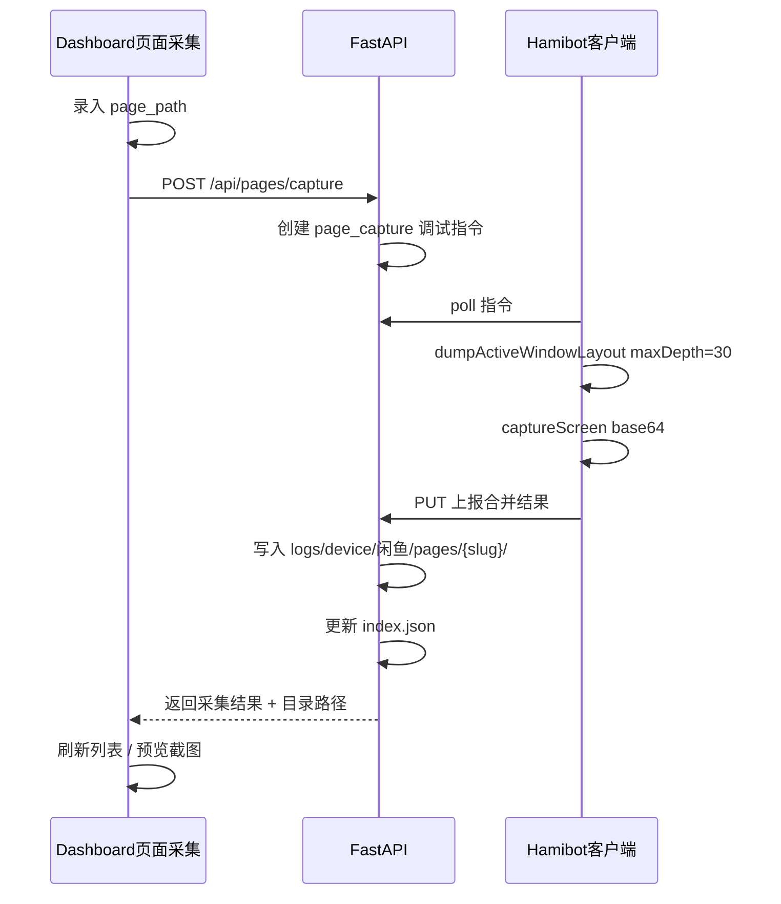

# 页面采集合功能规划

## 目标

支持人工在手机上进入闲鱼任意页面后，在 Dashboard 独立页面录入**页面路径**并点击**采集**按钮，触发 Hamibot 脚本抓取**最深布局树 + 截图**，持久化到 `logs/device/闲鱼/pages`，每个页面一个子目录，根目录 `index.json` 作为总目录索引。

与现有「调试工具」的区别：

| 维度 | 调试工具 (`page-debug`) | 页面采集（新） |
|------|------------------------|----------------|
| 深度 | 默认 3，UI 上限 10 | 最大深度（客户端默认 30，可配置） |
| 存储 | `server/data/debug/` + 1 小时清理 | `logs/device/闲鱼/pages/` 永久保留 |
| 操作 | layout / screenshot 分开 | 一次按钮 = 树 + 截图 |
| 组织 | 按指令 ID | 按页面路径目录 + 总索引 |

## 整体流程



## 存储目录设计

根路径（与 `server/core/device_logger.py` 的 `LOG_DIR` 一致）：

```
logs/device/闲鱼/pages/
├── index.json                          # 总目录：串联所有页面
├── 首页/
│   ├── meta.json                       # 页面元信息
│   ├── tree.json                       # 完整原始布局树（最大深度）
│   └── screenshot.jpg                  # 当前页面截图
├── 我的__我发布的/                      # page_path slug（/ → __）
│   ├── meta.json
│   ├── tree.json
│   └── screenshot.jpg
└── ...
```

### `index.json`（总目录文件）

```json
{
  "updated_at": "2026-06-12 15:30:00",
  "total": 2,
  "pages": [
    {
      "page_path": "首页",
      "dir": "首页",
      "activity": "com.taobao.idlefish.maincontainer.activity.MainActivity",
      "package": "com.taobao.idlefish",
      "fingerprint": "a3f8b2c1...",
      "captured_at": "2026-06-12 15:20:00",
      "tree_file": "tree.json",
      "screenshot_file": "screenshot.jpg"
    }
  ]
}
```

### 每个页面目录 `meta.json`

```json
{
  "page_path": "我的/我发布的",
  "dir": "我的__我发布的",
  "activity": "...",
  "package": "com.taobao.idlefish",
  "fingerprint": "...",
  "max_depth": 30,
  "node_count": 842,
  "captured_at": "2026-06-12 15:25:00",
  "source": "dashboard_capture"
}
```

**同名路径重复采集**：覆盖该目录下 `tree.json` / `screenshot.jpg` / `meta.json`，并在 `index.json` 更新 `captured_at`。

**路径 slug 规则**：`page_path.strip()` → 替换 `/` 为 `__` → 去除非法文件名字符 → 空则报错。

## API 端点

| 方法 | 路径 | 说明 |
|------|------|------|
| POST | `/api/pages/capture` | body: `{ page_path }` → 下发采集指令，轮询完成后落盘 |
| GET | `/api/pages` | 返回 `index.json` 列表 |
| GET | `/api/pages/{dir}` | 单页详情（meta + 截图 URL） |
| GET | `/api/pages/{dir}/screenshot` | 静态返回 jpg |
| GET | `/api/pages/{dir}/tree` | 返回 tree.json（大文件，Dashboard 按需加载） |

## 实现文件

| 文件 | 职责 |
|------|------|
| `server/services/page_corpus_store.py` | 目录读写、index.json 维护 |
| `server/routers/pages.py` | REST API + 采集轮询 |
| `server/routers/debug.py` | 新增 `page_capture` 指令类型 |
| `src/toolKit/xianyu/service/base.ts` | 客户端合并采集逻辑 |
| `server/static/dashboard.html` | 独立「页面采集」页面 |

## 与 AI Agent 模块的关系

- 采集数据可作为 [AI-Agent模块规划.md](./AI-Agent模块规划.md) 第四节「手动打标」的**原始素材库**
- 后续可选：从页面采集目录一键「提升为标注」→ `page_labels.json`

## 风险与约束

- **大 JSON**：深度 30 的树可能数 MB；Dashboard 列表只展示 meta，tree 按需 GET
- **截图权限**：客户端需已授权截图（与现有 debug screenshot 相同前提）
- **logs/ 已在 `.gitignore`**：采集数据默认不入库，符合预期
